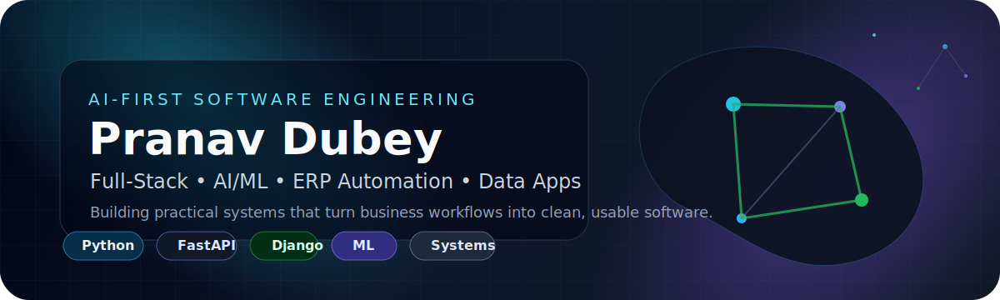
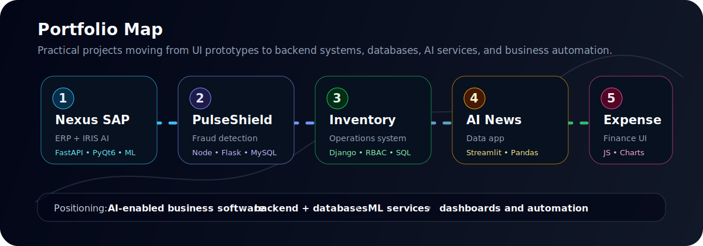
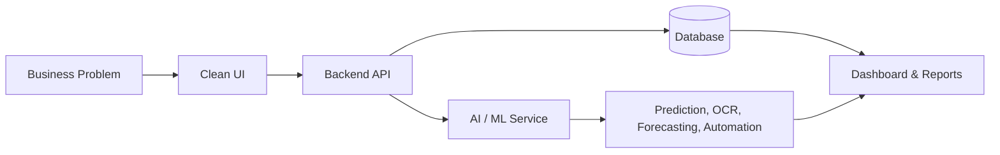

<p align="center">
  
</p>

<h1 align="center">Pranav Dubey</h1>
<h3 align="center">B.Tech CSE '27 • AI/ML + Full-Stack Systems • Business Workflow Automation</h3>

<p align="center">
  <a href="https://github.com/Shadow-Pranav?tab=repositories">
    
  </a>
  
  
</p>

---

## About Me

I am a Computer Science undergraduate building practical software systems around **AI automation, backend engineering, data dashboards, and enterprise workflows**.

My current portfolio is not random tutorial clutter. It is moving in one clear direction: **software that solves operational problems** — fraud detection, inventory control, ERP automation, finance tracking, and data-driven dashboards.

```text
Current positioning: AI-enabled full-stack developer
Best project signal: Nexus_SAP + PulseShield + Inventory Management System
Main improvement area: ship more polished deployments and live demos
```

---

## Portfolio Map

<p align="center">
  
</p>

---

## Featured Projects

<table>
  <tr>
    <td width="50%">
      <h3><a href="https://github.com/Shadow-Pranav/Nexus_SAP">Nexus_SAP</a></h3>
      <p><strong>AI-assisted ERP platform</strong> with a PyQt6 desktop client, FastAPI backend, Postgres, Redis, Celery workers, and IRIS AI/ML services.</p>
      <p><code>Python</code> <code>FastAPI</code> <code>PyQt6</code> <code>PostgreSQL</code> <code>Redis</code> <code>Celery</code> <code>OCR</code> <code>ML</code></p>
    </td>
    <td width="50%">
      <h3><a href="https://github.com/Shadow-Pranav/PulseShield">PulseShield</a></h3>
      <p><strong>E-commerce fraud detection system</strong> combining frontend screens, Node/Express APIs, a Flask ML prediction service, MySQL, authentication, and dashboard updates.</p>
      <p><code>Node.js</code> <code>Express</code> <code>Flask</code> <code>MySQL</code> <code>Socket.IO</code> <code>scikit-learn</code></p>
    </td>
  </tr>
  <tr>
    <td width="50%">
      <h3><a href="https://github.com/Shadow-Pranav/Inventory-Management-System">Inventory Management System</a></h3>
      <p><strong>Django inventory platform</strong> with role-based access, product/category management, stock logs, customer orders, staff/admin workflows, and database configuration.</p>
      <p><code>Django</code> <code>SQLite</code> <code>MySQL</code> <code>RBAC</code> <code>Plotly</code></p>
    </td>
    <td width="50%">
      <h3><a href="https://github.com/Shadow-Pranav/AI_NEWS_WEBAPP">AI News Web App</a></h3>
      <p><strong>Streamlit news dashboard</strong> for fetching headlines, keyword search, category filters, favorites, and data processing.</p>
      <p><code>Streamlit</code> <code>Python</code> <code>Pandas</code> <code>NewsAPI</code> <code>Plotly</code></p>
    </td>
  </tr>
  <tr>
    <td width="50%">
      <h3><a href="https://github.com/Shadow-Pranav/Expense-Tracker">Expense Tracker</a></h3>
      <p><strong>Browser-based personal finance tracker</strong> with income/expense entries, monthly budgets, charts, filters, and localStorage persistence.</p>
      <p><code>HTML</code> <code>CSS</code> <code>JavaScript</code> <code>Charts</code> <code>localStorage</code></p>
    </td>
    <td width="50%">
      <h3>Next Build Direction</h3>
      <p>Sharper live demos, cleaner deployments, stronger screenshots, and production-style documentation across the major projects.</p>
      <p><code>Deployment</code> <code>Testing</code> <code>Docs</code> <code>UI polish</code></p>
    </td>
  </tr>
</table>

---

## Tech Stack

### Languages & Core
<p>
  
  
  
  
  
</p>

### Backend, Web & Data
<p>
  
  
  
  
  
</p>

### Databases, Infra & ML
<p>
  
  
  
  
  
  
</p>

---

## System Design Pattern I Usually Build Around



---

## GitHub Snapshot

<p align="center">
  
  
</p>

<p align="center">
  
</p>

---

## What I Am Building Toward

<details open>
<summary><strong>AI + Enterprise Automation</strong></summary>
<br />
I am interested in systems that combine backend engineering, databases, dashboards, and AI workflows. My strongest current direction is ERP-style automation: approvals, invoice intelligence, operational dashboards, fraud detection, and business process intelligence.
</details>

<details>
<summary><strong>Data Analytics & Dashboards</strong></summary>
<br />
I build dashboards and data apps that make information easier to filter, inspect, and act on. This shows up in projects like AI News Web App, PulseShield dashboards, and finance/inventory tools.
</details>

<details>
<summary><strong>Full-Stack Product Thinking</strong></summary>
<br />
I care about the whole flow: user input, backend logic, database design, authentication, machine learning, charts, documentation, and demo readiness. The goal is not just code that runs, but software that can be explained and used.
</details>

---

## Current Priorities

- Convert major projects into **deployed demos** with screenshots and proper demo flows.
- Strengthen **backend fundamentals**: authentication, RBAC, testing, APIs, database modelling, and deployment.
- Improve **AI/ML implementation depth**: model evaluation, explainability, inference APIs, and data pipelines.
- Keep documentation clean enough that another developer can run the project without guessing.

---

## Repository Quality Checklist I Follow

- Clear README with project purpose, setup, screenshots, tech stack, and architecture.
- Environment variables documented through `.env.example`, not hardcoded secrets.
- Basic test or smoke-check commands where possible.
- Realistic project names and descriptions, not vague folder dumps.
- One strong project polished deeply beats ten half-dead repositories.

---

<p align="center">
  <strong>Building useful software. Improving the signal. Shipping better projects.</strong>
</p>
