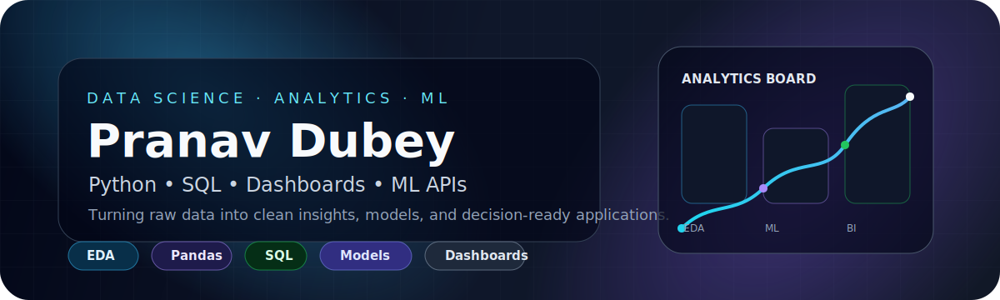
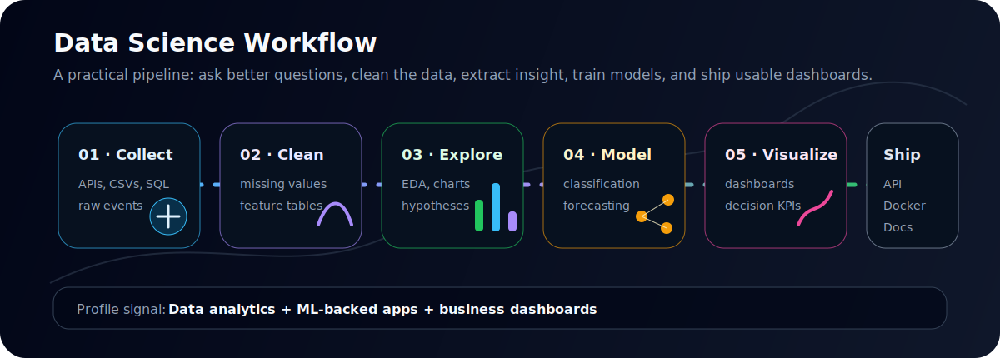
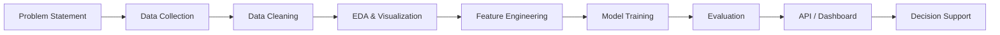

<p align="center">
  
</p>

<h1 align="center">Pranav Dubey</h1>
<h3 align="center">Data Science & Analytics-Focused CSE Student · Python · SQL · ML · Dashboards</h3>

<p align="center">
  <a href="https://github.com/Shadow-Pranav?tab=repositories">
    
  </a>
  
  
  
  
</p>

<p align="center">
  
</p>

---

## Data Profile

I am a **B.Tech CSE student** focused on building projects around **data analytics, machine learning, dashboards, automation, and business intelligence**.

My GitHub is being shaped around one clear direction:

```text
Raw Data → Cleaning → Analysis → ML Model → Dashboard/API → Business Decision
```

I am not just collecting random repositories. I am building toward a profile that shows I can work with data, extract patterns, build prediction systems, and present results in a usable interface.

---

## Analytics Lab

<p align="center">
  
</p>

---

## Featured Data & Analytics Projects

<table>
  <tr>
    <td width="50%">
      <h3><a href="https://github.com/Shadow-Pranav/PulseShield">PulseShield</a></h3>
      <p><strong>E-commerce fraud detection system</strong> built around transaction analysis, fraud probability scoring, database storage, and live dashboard monitoring.</p>
      <p><code>Python</code> <code>Flask</code> <code>scikit-learn</code> <code>pandas</code> <code>Node.js</code> <code>MySQL</code> <code>Socket.IO</code></p>
    </td>
    <td width="50%">
      <h3><a href="https://github.com/Shadow-Pranav/AI_NEWS_WEBAPP">AI News Web App</a></h3>
      <p><strong>Streamlit analytics app</strong> for fetching news, filtering by categories, searching keywords, saving articles, and processing data with pandas.</p>
      <p><code>Streamlit</code> <code>Python</code> <code>Pandas</code> <code>NewsAPI</code> <code>Plotly</code></p>
    </td>
  </tr>
  <tr>
    <td width="50%">
      <h3><a href="https://github.com/Shadow-Pranav/Nexus_SAP">Nexus_SAP</a></h3>
      <p><strong>AI-assisted ERP prototype</strong> with OCR pipelines, forecasting modules, anomaly detection, dashboard KPIs, Redis caching, and business workflow automation.</p>
      <p><code>FastAPI</code> <code>PostgreSQL</code> <code>Redis</code> <code>Celery</code> <code>OCR</code> <code>Forecasting</code> <code>Anomaly Detection</code></p>
    </td>
    <td width="50%">
      <h3><a href="https://github.com/Shadow-Pranav/Inventory-Management-System">Inventory Management System</a></h3>
      <p><strong>Operations analytics-ready Django app</strong> for products, categories, stock levels, inventory logs, role-based workflows, and order review.</p>
      <p><code>Django</code> <code>MySQL</code> <code>SQLite</code> <code>Plotly</code> <code>RBAC</code> <code>Business Data</code></p>
    </td>
  </tr>
  <tr>
    <td width="50%">
      <h3><a href="https://github.com/Shadow-Pranav/Expense-Tracker">Expense Tracker</a></h3>
      <p><strong>Personal finance dashboard</strong> with income/expense tracking, monthly budgets, trend charts, filters, and browser-local persistence.</p>
      <p><code>JavaScript</code> <code>Charts</code> <code>localStorage</code> <code>Finance Analytics</code></p>
    </td>
    <td width="50%">
      <h3>Next Data Project</h3>
      <p><strong>Customer Churn Analytics</strong> — planned as a proper DS project with EDA, feature engineering, model comparison, confusion matrix, ROC-AUC, and SHAP-style explainability.</p>
      <p><code>EDA</code> <code>Classification</code> <code>Model Evaluation</code> <code>Explainability</code></p>
    </td>
  </tr>
</table>

---

## Data Science Stack

<table>
  <tr>
    <td><strong>Programming</strong></td>
    <td><code>Python</code> <code>JavaScript</code> <code>SQL</code></td>
  </tr>
  <tr>
    <td><strong>Data Analysis</strong></td>
    <td><code>pandas</code> <code>NumPy</code> <code>Plotly</code> <code>Matplotlib</code></td>
  </tr>
  <tr>
    <td><strong>Machine Learning</strong></td>
    <td><code>scikit-learn</code> <code>classification</code> <code>forecasting</code> <code>anomaly detection</code></td>
  </tr>
  <tr>
    <td><strong>Dashboards</strong></td>
    <td><code>Streamlit</code> <code>Plotly</code> <code>Chart.js</code> <code>business KPIs</code></td>
  </tr>
  <tr>
    <td><strong>Backend & APIs</strong></td>
    <td><code>FastAPI</code> <code>Flask</code> <code>Django</code> <code>Express.js</code></td>
  </tr>
  <tr>
    <td><strong>Databases</strong></td>
    <td><code>MySQL</code> <code>PostgreSQL</code> <code>SQLite</code> <code>Redis</code></td>
  </tr>
  <tr>
    <td><strong>Deployment Direction</strong></td>
    <td><code>Docker</code> <code>API serving</code> <code>documentation</code> <code>demo-ready projects</code></td>
  </tr>
</table>

---

## Tools I Use

<p align="center">
  
</p>

---

## How I Think About Data Projects



---

## Current Learning Roadmap

<details open>
<summary><strong>Data Analytics</strong></summary>
<br />

- SQL joins, aggregation, window functions, and dashboard-ready queries.
- Exploratory data analysis using pandas, NumPy, and visualization libraries.
- KPI dashboards for business problems like inventory, fraud, finance, and operations.

</details>

<details>
<summary><strong>Machine Learning</strong></summary>
<br />

- Classification models for fraud/churn-style problems.
- Forecasting for demand, stock, and business time-series use cases.
- Evaluation using confusion matrix, precision, recall, ROC-AUC, and error analysis.

</details>

<details>
<summary><strong>MLOps & Deployment</strong></summary>
<br />

- Serving ML predictions through Flask/FastAPI APIs.
- Containerized apps with Docker.
- Clean README files, setup commands, environment variables, and reproducible demos.

</details>

---

## GitHub Snapshot

<p align="center">
  
  
</p>

<p align="center">
  
</p>

---

## What I Am Building Toward

```text
Goal: Become a developer who can analyze data, build models, explain insights,
and convert those insights into working applications.
```

I am especially interested in:

- Fraud detection and risk analytics
- Business intelligence dashboards
- Inventory and operations analytics
- Forecasting and anomaly detection
- ML-backed APIs and decision-support tools

---

