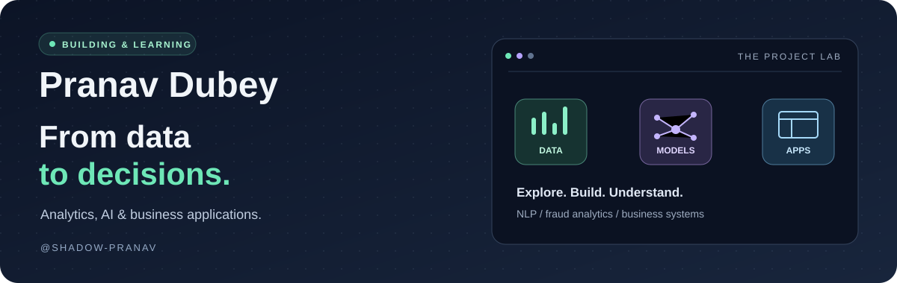

  

<strong>B.Tech CSE student · Python & SQL · Applied AI · Full-stack projects</strong>

  <a href="#featured-projects">Explore my work</a> &nbsp; / &nbsp;
  <a href="#latest-in-the-lab">Latest in the lab</a> &nbsp; / &nbsp;
  <a href="https://github.com/Shadow-Pranav?tab=repositories">All repositories</a>

## Hi, I'm Pranav 👋

I build projects that turn data into something people can use: a sentiment dashboard, a fraud score, an inventory workflow, or an AI assistant for business operations.

My focus is **data science and analytics**, connected to the APIs, databases, and interfaces that make an idea usable. This GitHub is my learning lab—from small browser apps to larger systems with access control, background jobs, and local AI.

## Latest in the lab

- **October 2026 · [Dynamic Authentication](https://github.com/Shadow-Pranav/Dynamic_Authentication)** — starting a Zero Trust Dynamic Authentication project with draft API contracts, trust-tier policies, and React/TypeScript tooling. **Early scaffold; the application is still to be built.**
- **September 2026 · [CG Foods Sentiment Analysis](https://github.com/Shadow-Pranav/CG_Foods_Sentimental_Analysis)** — a sentiment pipeline with VADER and multilingual transformers, event analysis, interactive filters, and PDF reports. The default demo uses **synthetic data**.
- **August 2026 · [SITS Inventory](https://github.com/Shadow-Pranav/Inventory-Management-System)** — rebuilt around Django and PostgreSQL, with organization isolation, inventory models, and role-based administration. Catalogue workflows are the next development phase.

## Featured projects

<table>
  <tr>
    <td width="50%" valign="top">
      <h3>01 / Sentiment & NLP</h3>
      <h4><a href="https://github.com/Shadow-Pranav/CG_Foods_Sentimental_Analysis">CG Foods Sentiment Tracker ↗</a></h4>
      
Explore brand sentiment through a pipeline for cleaning, classification, theme tagging, and statistical analysis around events.

      
<strong>Look inside:</strong> VADER vs. transformer comparison, a filterable dashboard, and PDF reporting. Synthetic data powers the default demo.

      
<code>Python</code> <code>FastAPI</code> <code>PostgreSQL</code> <code>Transformers</code> <code>Chart.js</code>

    </td>
    <td width="50%" valign="top">
      <h3>02 / AI & Business Operations</h3>
      <h4><a href="https://github.com/Shadow-Pranav/Nexus_AI_ERP">Nexus AI ERP ↗</a></h4>
      
A local FMCG operations prototype connecting purchase orders, goods receipts, inventory, and invoice processing.

      
<strong>Look inside:</strong> OCR-assisted invoice review, three-way matching, role-aware dashboards, and the iRiS assistant with local AI and document retrieval.

      
<code>React</code> <code>FastAPI</code> <code>PostgreSQL</code> <code>Ollama</code> <code>Docker</code>

    </td>
  </tr>
  <tr>
    <td width="50%" valign="top">
      <h3>03 / Fraud & Risk</h3>
      <h4><a href="https://github.com/Shadow-Pranav/PulseShield">PulseShield ↗</a></h4>
      
An e-commerce fraud detection project connecting a transaction interface, a Node.js API, and a Flask prediction service.

      
<strong>Look inside:</strong> transaction probability scores, stored transaction history, dashboard summaries, and CSV export.

      
<code>Flask</code> <code>scikit-learn</code> <code>Node.js</code> <code>MySQL</code>

    </td>
    <td width="50%" valign="top">
      <h3>04 / Inventory & Access Control</h3>
      <h4><a href="https://github.com/Shadow-Pranav/Inventory-Management-System">SITS — Smart Inventory ↗</a></h4>
      
An institutional inventory and compliance portal under phased development, with organization-scoped data and role-based access.

      
<strong>Look inside:</strong> tenancy isolation, catalogue and inventory models, membership administration, and permission tests.

      
<code>Django</code> <code>PostgreSQL</code> <code>Redis</code> <code>Docker</code>

    </td>
  </tr>
</table>

### More experiments

| Project | What you'll find | Built with |
| :--- | :--- | :--- |
| [Dynamic Authentication](https://github.com/Shadow-Pranav/Dynamic_Authentication) | Early Zero Trust authentication scaffold: draft OpenAPI contracts, trust policies, and frontend tooling. | OpenAPI · React/TypeScript tooling · Vite |
| [AI News Web App](https://github.com/Shadow-Pranav/AI_NEWS_WEBAPP) | NewsAPI headlines with keyword search, category filters, and saved articles. | Python · Streamlit · pandas |
| [Expense Tracker](https://github.com/Shadow-Pranav/Expense-Tracker) | Income, expenses, monthly budgets, and finance charts with browser-local storage. | HTML · CSS · JavaScript |

## My project toolkit

| Area | Technologies used across my repositories |
| :--- | :--- |
| **Data & ML** | Python, SQL, pandas, NumPy, scikit-learn, VADER, Hugging Face Transformers, SciPy |
| **APIs & applications** | FastAPI, Flask, Django, Node.js / Express, React, Streamlit |
| **Storage & background jobs** | PostgreSQL, MySQL, Redis, Celery |
| **AI & document workflows** | Ollama, Chroma, Tesseract OCR |
| **Delivery & testing** | Docker Compose, Git, pytest |

## What connects the work

**Understand the problem → prepare the data → build the logic → make it usable.**

I'm especially interested in NLP, fraud and risk analytics, business dashboards, and the engineering behind dependable applications. Each project gives me a different piece of that picture: evaluating a classifier, enforcing permissions, explaining an invoice mismatch, or presenting a useful trend.

  <strong>Explore a repository, follow the implementation, and see what I'm learning next.</strong> 
  <a href="https://github.com/Shadow-Pranav?tab=repositories">Browse all projects →</a>

<!-- Reviewed against all 8 public repositories on 2026-10-03. Descriptions reflect source and documented development status, not production-readiness claims. -->
